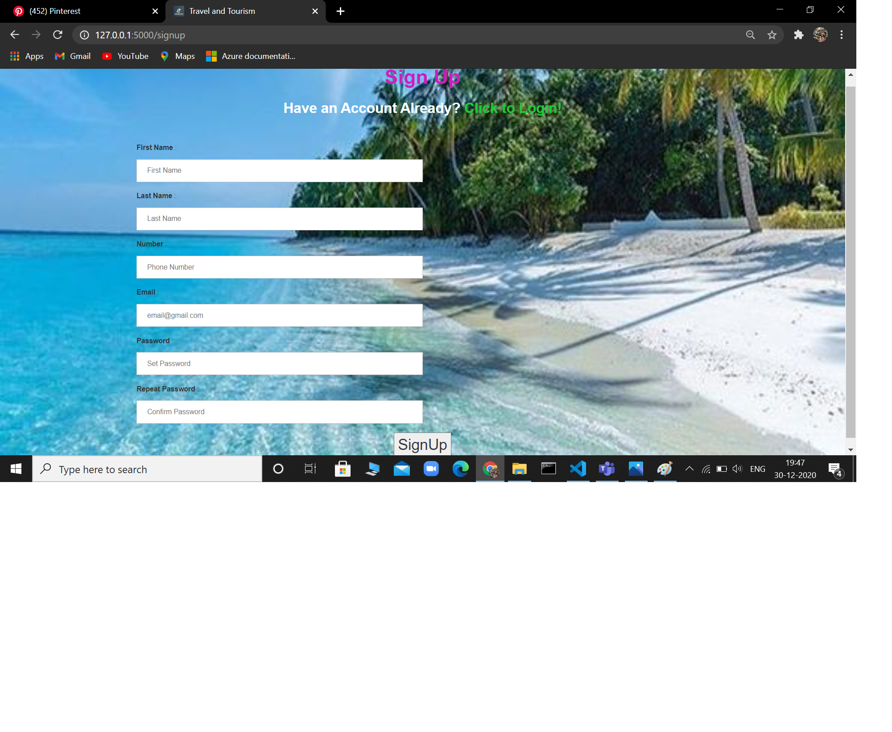
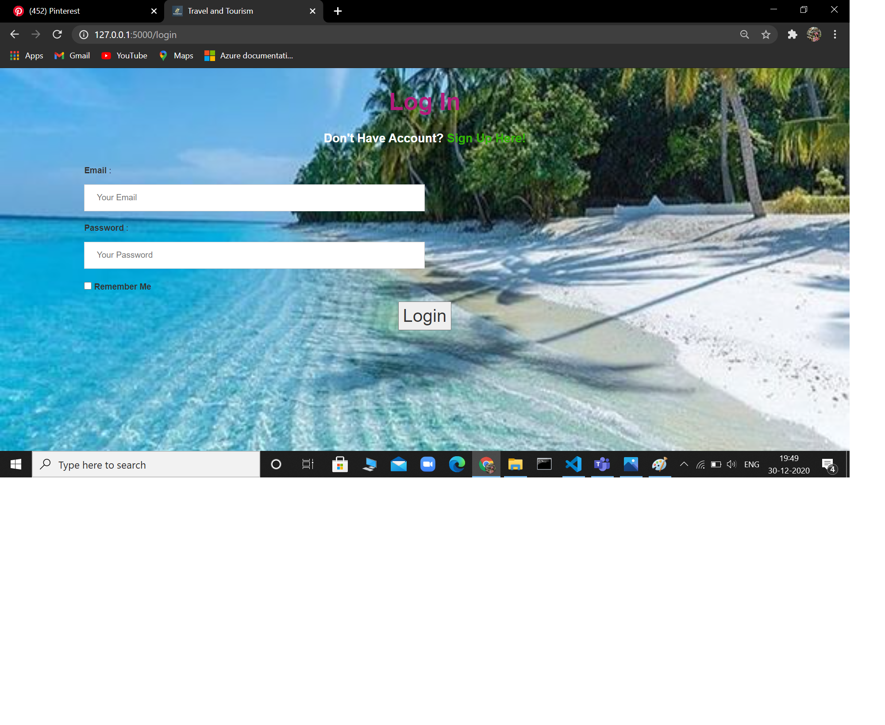

# TRAVEL AND TOURISM :airplane: :hotel: :mountain_railway:
### Database Based Web Application which focuses on Booking and managing Tour for Customer ,Implemented using Flask, Sqlite3,SqlAlchemy,Html,Css,JS
---
#### Overview :scroll:
* Travel and Tourism is a Database Based Web Application that allows the user of the system access all the details to different cities and places.
* It focuses on Booking and managing Tour for Customers.The Customers can create their accounts by Signing Up after which they can log in and select services Provided by the website
* Users can choose different Tour packages with specific number of days of vacationing and Costs are included in each Packages.
* Users can also choose Accommodation and Transportation as per their convenience.
* After all selections are done they can check their details and Confirm payment. If facing any Difficulties or queries can Contact Administrator who can do the needful.
----

## How To Use 🔧

From your command line:

```bash

# Clone this repository in Git Bash
$ git clone https://github.com/TechieMeSB/DBMS_MiniProject.git

# Go into the repository
$ cd DBMS_MiniProject
```
----
##### Register and Login Page  
<div >
  
  
  
</div>
<br>

___________

##### Packages <br>
<div>
  
  
  
  
  
  
  
  
  
  
  
</div>
<br>

__________

###### Admin Dashboard <br>
<div>
  
   
  
</div>
<div>
  
   
  
</div>

---
## Languages used for Implementation  :scroll: :wrench:
  * Backend : Flask Framework with SqlAlchemy
  * Frontend : HTML,CSS,Javascript,Bootstrap3
  
  <div>
  
  
  
 
 
</div>
  
